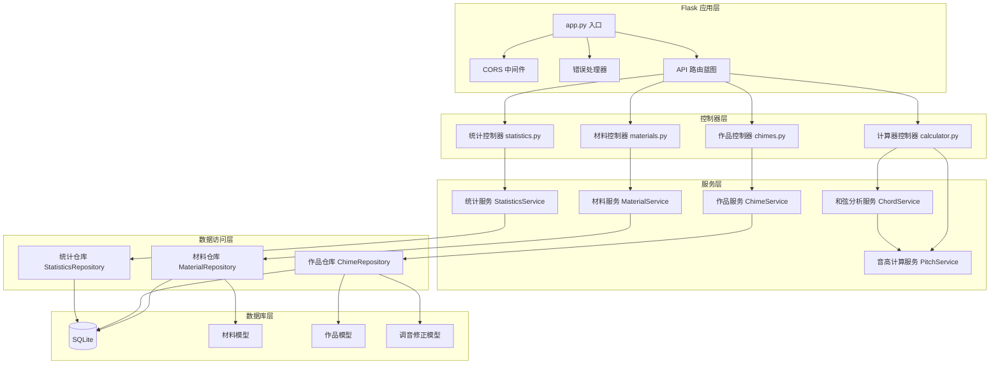
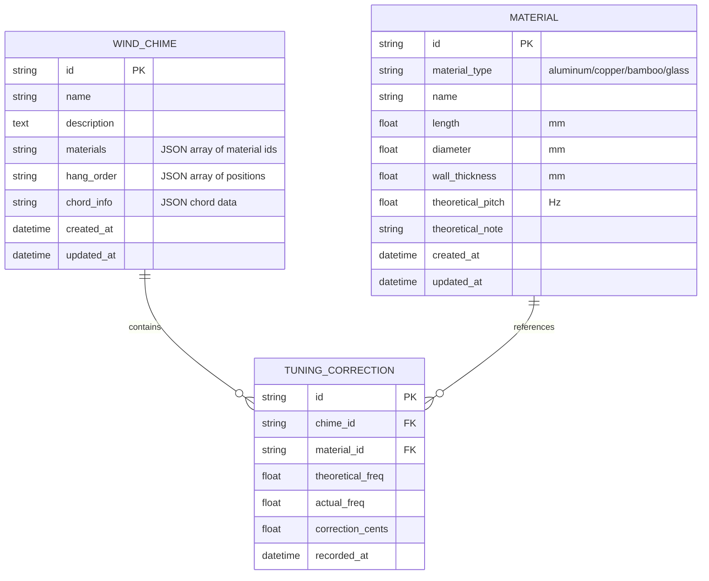

## 1. 架构设计

```mermaid
graph TD
    subgraph "前端 (端口: 9201)"
        A[React 18 + TypeScript] --> B[Vite 构建工具]
        A --> C[Tailwind CSS 3 样式]
        A --> D[React Router 路由]
        A --> E[Zustand 状态管理]
        A --> F[Web Audio API 音频合成]
        A --> G[Chart.js 数据可视化]
        A --> H[@dnd-kit 拖拽库]
        A --> I[Lucide React 图标]
    end

    subgraph "后端 (端口: 9202)"
        J[Flask 3.x] --> K[Flask-CORS 跨域]
        J --> L[SQLite 数据库]
        J --> M[物理音高计算引擎]
        J --> N[RESTful API]
    end

    subgraph "数据层"
        O[材料数据表] --> L
        P[作品数据表] --> L
        Q[调音修正记录表] --> L
    end

    F -->|音频合成| A
    G -->|图表渲染| A
    H -->|拖拽交互| A
    N -->|HTTP请求| A
```

## 2. 技术描述

### 2.1 前端技术栈
- **框架**: React 18 + TypeScript
- **构建工具**: Vite 5.x
- **样式方案**: Tailwind CSS 3.4.x
- **路由管理**: React Router DOM 6.x
- **状态管理**: Zustand 4.x
- **音频合成**: Web Audio API (原生)
- **图表可视化**: Chart.js 4.x + react-chartjs-2
- **拖拽交互**: @dnd-kit/core + @dnd-kit/sortable
- **图标库**: Lucide React
- **HTTP客户端**: Axios
- **开发端口**: 9201

### 2.2 后端技术栈
- **框架**: Flask 3.0.x
- **跨域处理**: Flask-CORS 4.x
- **数据库**: SQLite 3 (文件存储)
- **ORM**: SQLAlchemy 2.x
- **数据验证**: Pydantic 2.x
- **开发端口**: 9202

### 2.3 音高计算原理
基于管乐器声学公式计算开管基频：
```
f = (v * n) / (2 * L * (1 + 0.8 * d))
其中:
- f: 频率 (Hz)
- v: 声速 (常温约343 m/s)
- n: 泛音序数 (基频n=1)
- L: 管体有效长度 (m)
- d: 管体内径 (m)
- 0.8: 管口修正系数
```

材料密度影响泛音衰减特性：
- 铝 (2700 kg/m³): 泛音丰富，衰减中等
- 铜 (8960 kg/m³): 泛音饱满，衰减较慢
- 竹 (700 kg/m³): 泛音柔和，衰减较快
- 玻璃 (2500 kg/m³): 泛音清澈，衰减中等

## 3. 路由定义

| 路由路径 | 页面名称 | 说明 |
|----------|----------|------|
| / | 首页导航 | 功能入口卡片 |
| /materials | 材料库 | 管体材料管理 |
| /calculator | 音高计算器 | 单管参数计算与试听 |
| /listener | 虚拟试听器 | 拖拽组装与和弦模拟 |
| /archive | 作品归档 | 历史作品管理 |
| /statistics | 统计分析 | 多维度数据展示 |

## 4. API 定义

### 4.1 材料管理 API

```typescript
// 材料类型定义
interface Material {
  id: string;
  material_type: 'aluminum' | 'copper' | 'bamboo' | 'glass';
  name: string;
  length: number;        // 单位: mm
  diameter: number;      // 单位: mm
  wall_thickness: number; // 单位: mm
  theoretical_pitch: number; // 理论频率 Hz
  theoretical_note: string; // 理论音符 (如 "C4", "G5")
  created_at: string;
  updated_at: string;
}

// GET /api/materials - 获取材料列表
// 响应: { data: Material[], total: number }

// POST /api/materials - 创建材料
// 请求: Omit<Material, 'id' | 'theoretical_pitch' | 'theoretical_note' | 'created_at' | 'updated_at'>
// 响应: Material

// PUT /api/materials/:id - 更新材料
// 请求: Partial<Omit<Material, 'id' | 'created_at'>>
// 响应: Material

// DELETE /api/materials/:id - 删除材料
// 响应: { success: boolean }
```

### 4.2 音高计算 API

```typescript
// POST /api/calculate/pitch - 计算理论音高
// 请求:
{
  material_type: 'aluminum' | 'copper' | 'bamboo' | 'glass';
  length: number;        // mm
  diameter: number;      // mm
  wall_thickness: number; // mm
}

// 响应:
{
  frequency: number;     // 基频 Hz
  note: string;          // 音符名称 (如 "C4")
  octave: number;        // 八度
  cents_deviation: number; // 与标准音的音分偏差
  overtones: Array<{     // 泛音列
    harmonic: number;
    frequency: number;
    amplitude: number;
  }>;
  material_properties: {
    density: number;     // 材料密度 kg/m³
    sound_velocity: number; // 材料声速 m/s
    decay_rate: number;  // 衰减系数
  };
}
```

### 4.3 和弦分析 API

```typescript
// POST /api/analyze/chord - 分析和弦
// 请求:
{
  frequencies: number[]; // 管体频率数组
}

// 响应:
{
  chord_name: string;    // 和弦名称 (如 "C Major", "Am7")
  chord_quality: 'major' | 'minor' | 'diminished' | 'augmented' | 'sus4' | 'sus2';
  intervals: string[];   // 音程关系
  root_note: string;     // 根音
  dissonance_score: number; // 不协和度 0-100
  suggested_frequencies: number[]; // 优化建议频率
}
```

### 4.4 作品管理 API

```typescript
// 作品类型定义
interface WindChime {
  id: string;
  name: string;
  description: string;
  materials: string[];   // 材料ID数组，按悬挂顺序排列
  hang_order: number[];  // 悬挂位置索引
  chord_info: {
    chord_name: string;
    frequencies: number[];
    notes: string[];
  };
  tuning_corrections: Array<{
    material_id: string;
    theoretical_freq: number;
    actual_freq: number;
    correction_cents: number;
    recorded_at: string;
  }>;
  created_at: string;
  updated_at: string;
}

// GET /api/chimes - 获取作品列表
// POST /api/chimes - 创建作品
// GET /api/chimes/:id - 获取作品详情
// PUT /api/chimes/:id - 更新作品
// DELETE /api/chimes/:id - 删除作品
```

### 4.5 统计分析 API

```typescript
// GET /api/statistics/overview - 获取统计概览
// 响应:
{
  total_materials: number;
  total_chimes: number;
  material_breakdown: Record<string, number>; // 各材质数量
  avg_dissonance: number; // 平均不协和度
}

// GET /api/statistics/pitch-range - 材质音域分布
// 响应:
{
  material: string;
  min_freq: number;
  max_freq: number;
  min_note: string;
  max_note: string;
  count: number;
}[]

// GET /api/statistics/chords - 热门和弦组合
// 响应:
{
  chord_name: string;
  count: number;
  avg_dissonance: number;
}[]

// GET /api/statistics/material-usage - 材料利用率
// 响应:
{
  material_type: string;
  total_count: number;
  used_count: number;
  utilization_rate: number; // 使用率 %
}[]

// GET /api/statistics/tuning-corrections - 调音修正记录
// 响应:
{
  material_type: string;
  avg_correction_cents: number;
  correction_count: number;
  trend: 'positive' | 'negative' | 'stable';
}[]
```

## 5. 服务器架构图



## 6. 数据模型

### 6.1 ER 图



### 6.2 DDL 语句

```sql
-- 材料表
CREATE TABLE IF NOT EXISTS materials (
    id TEXT PRIMARY KEY,
    material_type TEXT NOT NULL CHECK (material_type IN ('aluminum', 'copper', 'bamboo', 'glass')),
    name TEXT NOT NULL,
    length REAL NOT NULL,
    diameter REAL NOT NULL,
    wall_thickness REAL NOT NULL,
    theoretical_pitch REAL NOT NULL,
    theoretical_note TEXT NOT NULL,
    created_at DATETIME DEFAULT CURRENT_TIMESTAMP,
    updated_at DATETIME DEFAULT CURRENT_TIMESTAMP
);

CREATE INDEX idx_materials_type ON materials(material_type);
CREATE INDEX idx_materials_pitch ON materials(theoretical_pitch);

-- 作品表
CREATE TABLE IF NOT EXISTS wind_chimes (
    id TEXT PRIMARY KEY,
    name TEXT NOT NULL,
    description TEXT,
    materials TEXT NOT NULL,
    hang_order TEXT NOT NULL,
    chord_info TEXT NOT NULL,
    created_at DATETIME DEFAULT CURRENT_TIMESTAMP,
    updated_at DATETIME DEFAULT CURRENT_TIMESTAMP
);

CREATE INDEX idx_chimes_created ON wind_chimes(created_at);

-- 调音修正表
CREATE TABLE IF NOT EXISTS tuning_corrections (
    id TEXT PRIMARY KEY,
    chime_id TEXT REFERENCES wind_chimes(id) ON DELETE CASCADE,
    material_id TEXT REFERENCES materials(id) ON DELETE CASCADE,
    theoretical_freq REAL NOT NULL,
    actual_freq REAL NOT NULL,
    correction_cents REAL NOT NULL,
    recorded_at DATETIME DEFAULT CURRENT_TIMESTAMP
);

CREATE INDEX idx_corrections_material ON tuning_corrections(material_id);
CREATE INDEX idx_corrections_chime ON tuning_corrections(chime_id);

-- 初始化示例数据
INSERT INTO materials (id, material_type, name, length, diameter, wall_thickness, theoretical_pitch, theoretical_note) VALUES
('mat_001', 'copper', '长铜铃', 180, 25, 1.5, 523.25, 'C5'),
('mat_002', 'aluminum', '中音铝管', 150, 20, 1.0, 659.25, 'E5'),
('mat_003', 'bamboo', '竹制短管', 120, 22, 2.0, 783.99, 'G5'),
('mat_004', 'glass', '玻璃高音', 100, 18, 3.0, 1046.50, 'C6'),
('mat_005', 'copper', '低音铜铃', 220, 30, 2.0, 392.00, 'G4');
```

## 7. 前端状态管理设计

```typescript
// Zustand store 定义
interface AppState {
  // 材料状态
  materials: Material[];
  selectedMaterial: Material | null;
  materialFilter: {
    type: string | null;
    pitchRange: [number, number] | null;
    search: string;
  };
  
  // 计算器状态
  calculatorParams: {
    material_type: string;
    length: number;
    diameter: number;
    wall_thickness: number;
  };
  calculationResult: PitchResult | null;
  
  // 试听器状态
  selectedTubes: Material[];
  hangOrder: number[];
  isPlaying: boolean;
  chordAnalysis: ChordAnalysis | null;
  
  // 作品状态
  chimes: WindChime[];
  currentChime: WindChime | null;
  
  // 操作方法
  fetchMaterials: () => Promise<void>;
  addMaterial: (data: CreateMaterialData) => Promise<void>;
  updateMaterial: (id: string, data: UpdateMaterialData) => Promise<void>;
  deleteMaterial: (id: string) => Promise<void>;
  calculatePitch: (params: CalculatorParams) => Promise<void>;
  playSingleNote: (frequency: number, materialType: string) => void;
  playChord: (frequencies: number[], materialTypes: string[]) => void;
  saveChime: (data: CreateChimeData) => Promise<void>;
  fetchChimes: () => Promise<void>;
  loadChimeToEditor: (chime: WindChime) => void;
}
```

## 8. 前端目录结构

```
frontend/src/
├── components/
│   ├── layout/
│   │   ├── Header.tsx
│   │   ├── Sidebar.tsx
│   │   └── PageContainer.tsx
│   ├── materials/
│   │   ├── MaterialCard.tsx
│   │   ├── MaterialForm.tsx
│   │   ├── MaterialFilter.tsx
│   │   └── MaterialGrid.tsx
│   ├── calculator/
│   │   ├── ParamSlider.tsx
│   │   ├── PitchDisplay.tsx
│   │   ├── SpectrumChart.tsx
│   │   └── AudioPlayer.tsx
│   ├── listener/
│   │   ├── TubeShelf.tsx
│   │   ├── ChimeCanvas.tsx
│   │   ├── DraggableTube.tsx
│   │   ├── ChordPanel.tsx
│   │   └── WindEffect.tsx
│   ├── archive/
│   │   ├── ChimeCard.tsx
│   │   ├── ChimeDetail.tsx
│   │   └── TimelineGroup.tsx
│   ├── statistics/
│   │   ├── StatCard.tsx
│   │   ├── PitchRangeChart.tsx
│   │   ├── ChordPopularityChart.tsx
│   │   ├── MaterialUsageChart.tsx
│   │   └── TuningTrendChart.tsx
│   └── ui/
│       ├── Button.tsx
│       ├── Input.tsx
│       ├── Modal.tsx
│       ├── Tabs.tsx
│       └── Select.tsx
├── pages/
│   ├── Home.tsx
│   ├── Materials.tsx
│   ├── Calculator.tsx
│   ├── Listener.tsx
│   ├── Archive.tsx
│   └── Statistics.tsx
├── hooks/
│   ├── useAudioSynthesis.ts
│   ├── useMaterialCRUD.ts
│   ├── useChordAnalysis.ts
│   └── useDragAndDrop.ts
├── store/
│   └── useAppStore.ts
├── services/
│   ├── api.ts
│   ├── materialService.ts
│   ├── calculatorService.ts
│   ├── chimeService.ts
│   └── statisticsService.ts
├── types/
│   └── index.ts
├── utils/
│   ├── audioUtils.ts
│   ├── pitchUtils.ts
│   ├── materialUtils.ts
│   └── chartUtils.ts
├── App.tsx
├── main.tsx
└── index.css
```

## 9. 后端目录结构

```
backend/
├── app.py
├── config.py
├── requirements.txt
├── models/
│   ├── __init__.py
│   ├── material.py
│   ├── chime.py
│   └── tuning_correction.py
├── controllers/
│   ├── __init__.py
│   ├── materials.py
│   ├── calculator.py
│   ├── chimes.py
│   └── statistics.py
├── services/
│   ├── __init__.py
│   ├── material_service.py
│   ├── pitch_service.py
│   ├── chord_service.py
│   ├── chime_service.py
│   └── statistics_service.py
├── repositories/
│   ├── __init__.py
│   ├── base_repository.py
│   ├── material_repository.py
│   ├── chime_repository.py
│   └── statistics_repository.py
├── schemas/
│   ├── __init__.py
│   ├── material.py
│   ├── calculator.py
│   ├── chime.py
│   └── statistics.py
├── utils/
│   ├── __init__.py
│   ├── pitch_calculator.py
│   ├── chord_analyzer.py
│   ├── database.py
│   └── constants.py
├── data/
│   └── wind_chime.db
└── migrations/
    └── init.sql
```
